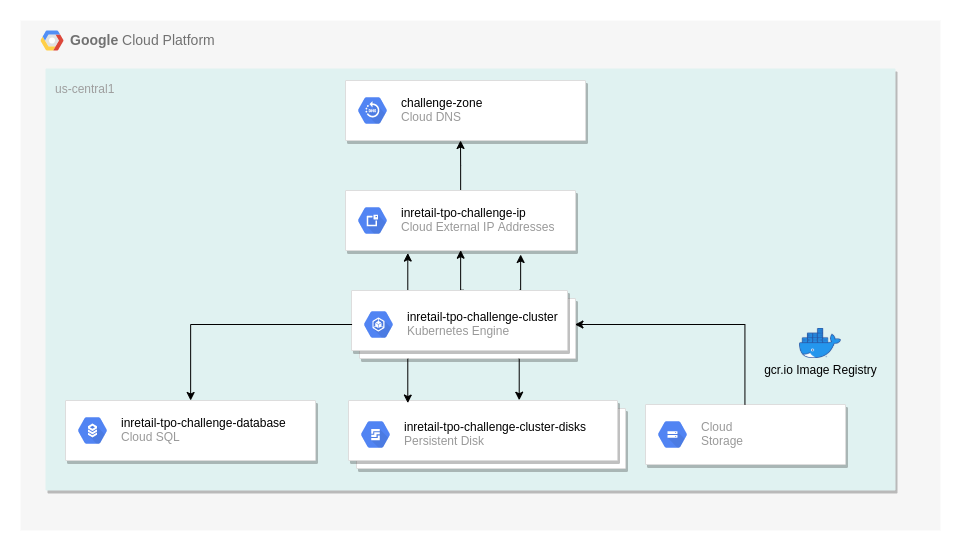
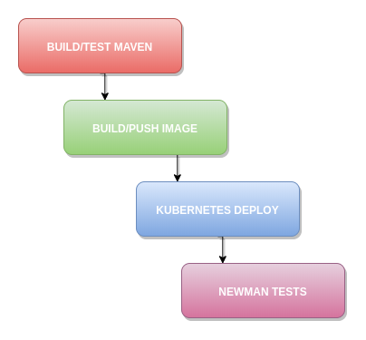

# Intercorp retail TPO CHALLENGE
### 
Reto técnico full stack Intercorp retail **Marco A Villarreal B**


# Componentes

Componente| Descripción|Tecnología
---|---|---
customers-api| Microservicio de clientes|Spring Boot
customers-web| Front end de clientes|Angular
customers-openapi| Documentación swagger|Open api 3
platform| Plataforma |Terraform & GCP

# Plataforma GCP

A continuación se ilustra la plataforma de GCP desplegada para el reto




La plataforma GCP consiste de los siguientes componentes:

* Subred para cluster kubernetes y base de datos
* Ip Estática global para resolución a la calle
* Configuración cloud DNS(dominio mvillarreal.com)
* Cluster GKE(2 nodos)
* Instancia Cloud SQL
* Container Registry de Google GKE

# Instalación

## Aprovisionamiento con Terraform


A continuación se describen los pasos para instalar la plataforma GCP con terraform

### Requerimientos

* Cli de Google cloud 
* Terraform v0.12.12


```sh
gcloud projects list

# Creación del proyecto de GCP
gcloud projects create mvillarreal-tpo-challenge

# Setear el proyecto como el proyecto actual
gcloud config set project mvillarreal-tpo-challenge

# Habilita la api de kubernetes para el projecto(debe haber billing account asociada)
gcloud services enable container.googleapis.com

# Habilita la api de container registry para el projecto(debe haber billing account asociada)
gcloud services enable containerregistry.googleapis.com

# Habilita la api de sqladmin(para creas instancias de cloud SQL)
gcloud services enable sqladmin.googleapis.com

# Habilita la api de servicenetworking(para las subredes)
gcloud services enable servicenetworking.googleapis.com

# Creación del service account para terraform
gcloud iam service-accounts create inretail-tpo-saccount \
    --description "Main service account for terraform" \
    --display-name "inretail-tpo-service-account"


# Asignar rol editor al service account(revisar comando)
gcloud projects add-iam-policy-binding mvillarreal-tpo-challenge \
  --member serviceAccount:inretail-tpo-saccount@mvillarreal-tpo-challenge.iam.gserviceaccount.com \
  --role roles/editor 
  
gcloud projects add-iam-policy-binding mvillarreal-tpo-challenge \
  --member serviceAccount:inretail-tpo-saccount@mvillarreal-tpo-challenge.iam.gserviceaccount.com \
  --role roles/servicenetworking.networksAdmin


# Se exporta la key del service account para ser usada por terraform
gcloud iam service-accounts keys create $(pwd)/platform/service-account-key.json \
  --iam-account inretail-tpo-saccount@mvillarreal-tpo-challenge.iam.gserviceaccount.com


#Init de terraform
terraform init

# Ver el plan de terraform(antes de ejecutar)
terraform plan

#Que comience la fiesta!(esto puede tardar varios minutos, recordemos que se esta aprovisionando una plataforma entera)
terraform apply
```

## Configuraciones de Kubernetes
```sh

# Luego
# Crea el namespace de aplicaciones
kubectl create namespace apps

# Crear el secret para los deploy tengan permiso de hacer pull al registry gcr.io
kubectl create secret docker-registry gcr-json-key \
--docker-server=gcr.io \
--docker-username=_json_key \
--docker-password="$(cat $(pwd)/platform/service-account-key.json)" \
--docker-email=erick.slayer.m.v@gmail.com \
-n apps
```
## Ajustes del cert manager

A continuación de describen los pasos para configurar el cert-manager
de kubernetes configurado para el issuer del let's encrypt

### Requerimientos

* Kubeconfig apuntando a nuestro cluster
* Helm v2.14.3 (Para el ingress)

```sh
# Crea service account tiller para helm
kubectl create serviceaccount -n kube-system tiller

# Crea cluster role binding para tiller
kubectl create clusterrolebinding tiller-binding \
--clusterrole=cluster-admin \
--serviceaccount kube-system:tiller

# Inicializa el helm con el service account
helm init --service-account tiller

# Actualización de repos de helm
helm repo update

# Instalación del cert-manager
helm install --name cert-manager --version v0.5.2 \
--namespace kube-system stable/cert-manager


export EMAIL=erick.slayer.m.v@gmail.com

# Creación del cert issuer de letsencrypt
curl -sSL https://rawgit.com/ahmetb/gke-letsencrypt/master/yaml/letsencrypt-issuer.yaml | \
    sed -e "s/email: ''/email: $EMAIL/g" | \
    kubectl apply -f-
```

## Microservicio customer-api

Se despliega usando el pipeline en el directorio .github, en el diagrama se observan las etapas del pipeline



* BUILD/TEST MAVEN: Ejecuta las pruebas unitarias y compila el archivo Jar

* BUILD/PUSH IMAGE: Construye la imagen docker basada en el Dockerfile encontrado en la raíz del este proyecto, así mismo hace un push al Google Container Registry(GCR).

* KUBERNETES DEPLOY: Despliega ó actualiza en Google Kubernetes Engine los cambios realizados.

* NEWMAN TESTS una vez desplegados los cambios se usa newman para correr un test funcional básico.

# Frontend App

Se despliega usando firebase cli usando el comando

```sh
firebase deploy
```

## Test de la Api

Para probar la api rest de customers puede usar la colección de postman del directorio customers-api e invocarla usando newman como se muestra:

```sh
npm install -g newman
cd ./customers-api && newman run customer-api.postman_collection.json

```

## ROADMAP

* Agregar sonar cloud en el pipeline (Necesito pagar porque ahorita esta privado mi repo XD )

* Implementar certificado y dominio en firebase hosting

* Probar con Ingress de traefik (soĺo porque es divertido)